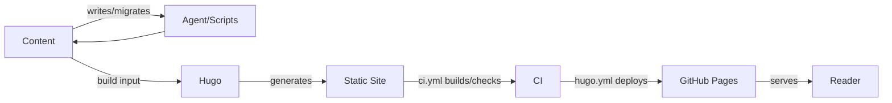

# davevoyles.com

## Overview

davevoyles.com is Dave's personal website — his blog and portfolio in one place. The old version got shut down and lost, so this one was rebuilt from scratch out of plain text files instead of anything that could break or go offline unexpectedly. It holds what Dave writes about games, software, and building things with AI coding agents, plus a page showing his work and skills. Anyone can just visit davevoyles.com and read it — no login, nothing to install. People helping keep it running, whether a person or an AI agent, start from one map file that shows where everything lives and how a new post gets published.

## What it provides and why

A static Hugo site with a hand-built home dashboard, an About page with an interactive agent constellation, and a writing pipeline (draft → gate → publish) that a human or an agent can run the same way. It exists so publishing a post never depends on a server, or Dave being the only one who can touch it — plain Markdown in, static HTML out.

## The picture



## Start

```bash
make submodules   # once per fresh checkout (PaperMod)
make preview      # hugo server -D -F  (drafts + future-dated)
```

Open `http://localhost:1313/` (home), `/about/`, `/graph/`, `/archives/`.

## Map

- Full path-by-path repo map — [below, "Repo map"](#repo-map)
- Design plan and ADRs — [`docs/design/`](docs/design/), [`docs/decisions/`](docs/decisions/)
- Writing a post — [`docs/authoring-guide.md`](docs/authoring-guide.md)
- How the platform works — [`docs/platform-guide.md`](docs/platform-guide.md)
- Task log — [`history.md`](history.md)

## For agents

Start at [`AGENTS.md`](AGENTS.md) — the router for coding agents. Claim-safe numbers and banned claims: [`docs/claim-safe-facts.md`](docs/claim-safe-facts.md). `make check` runs the content gates and must pass before anything lands.

---

See [`docs/design/0001-rebuild-davevoylescom-blog.md`](docs/design/0001-rebuild-davevoylescom-blog.md)
for the full plan, and [`docs/decisions/`](docs/decisions/) for the
architectural decisions behind it.

Writing a new post? See [`docs/authoring-guide.md`](docs/authoring-guide.md).
Wondering how the platform itself works — styling, images, video, what it
can't do? See [`docs/platform-guide.md`](docs/platform-guide.md).
Changing the homepage, About page, projects grid, or WebGL surfaces?
See [`docs/portfolio-surfaces.md`](docs/portfolio-surfaces.md) first.
Want a snapshot of the current design system (colors, type, layout,
components)? See [`docs/DESIGN.md`](docs/DESIGN.md).

Home is a **dashboard + magazine desk** (not a full archive dump);
`/about/` is a portfolio page with an interactive agent constellation.

## Repo map

A quick orientation for anyone (human or agent) new to this checkout —
what each top-level folder is for and when you'd touch it.

| Path | What's in it | When you'd touch it |
|---|---|---|
| [`content/posts/`](content/posts/) | Blog posts as Hugo Markdown (front matter: `title`, `date`, `draft`, `tags`, optional `topics`, covers). | Writing, editing, or triaging a post. See [`docs/authoring-guide.md`](docs/authoring-guide.md). |
| [`content/about.md`](content/about.md) | About portfolio — **data-driven** `[about]` front matter (skills, stats, constellation). Body is unused by the layout. | Editing About identity, skills, impact, or the agent system map. See [`docs/portfolio-surfaces.md`](docs/portfolio-surfaces.md). |
| [`layouts/`](layouts/) | Site overrides of PaperMod: `index.html` (home dashboard), `about.html`, `graph.html`, `single.html`, sidebar/TOC/vault partials. | Changing home/About/graph shell or post chrome — prefer this over editing the theme submodule. |
| [`assets/css/extended/custom.css`](assets/css/extended/custom.css) | Console theme (green accent, light/dark tokens) + home/About component styles. | Colors, spacing, portfolio UI polish. |
| [`assets/js/`](assets/js/) | Site JS: `home-hero-webgl.js`, `about-constellation.js`, search/TOC overrides. Loaded only from the pages that need them. | Interactive surfaces; keep progressive enhancement + reduced-motion. |
| [`static/images/`](static/images/) | Images committed to the repo (no LFS — see [ADR 0002](docs/decisions/0002-images-committed-to-repo.md)). Referenced as `/images/<file>`. | Adding an image to a post or page. |
| [`static/CNAME`](static/CNAME) | Custom domain for GitHub Pages (`davevoyles.com`). | Almost never — only if the domain changes. |
| [`archetypes/default.md`](archetypes/default.md) | Template for `hugo new content posts/<slug>.md`. | Changing default new-post front matter. |
| [`themes/PaperMod/`](themes/PaperMod/) | Git submodule. **Empty on fresh clone** until `git submodule update --init --recursive`. | Prefer site-level `layouts/` + `assets/` overrides; don't edit the submodule for features. |
| [`scripts/`](scripts/) | Migration/triage utilities. See [`scripts/README.md`](scripts/README.md). | Recovering old content or re-running mapping/triage. |
| [`docs/portfolio-surfaces.md`](docs/portfolio-surfaces.md) | **Agent map** for home, About, projects, constellation, WebGL. | Any portfolio UI change. |
| [`docs/design/`](docs/design/) | Design plans for major initiatives. | Understanding scope of large work. |
| [`docs/decisions/`](docs/decisions/) | ADRs (including [0010](docs/decisions/0010-home-dashboard-not-full-archive.md) home dashboard). | Before reversing a deliberate choice. |
| [`AGENTS.md`](AGENTS.md) | Thin router for coding agents. | First file to open in a new session. |
| [`docs/post-pipeline.md`](docs/post-pipeline.md) | Who does what: Dave, agent, site. Diagram: [`docs/diagrams/post-pipeline.html`](docs/diagrams/post-pipeline.html). | "How do we make a post?" |
| [`docs/claim-safe-facts.md`](docs/claim-safe-facts.md) | Allowed metrics, banned claims, constellation node ids. | Any post/About copy with numbers or product claims. |
| [`docs/authoring-guide.md`](docs/authoring-guide.md) | Write → preview → publish a post (includes voice do/don't). | Every new post. |
| [`docs/idea-playbook.md`](docs/idea-playbook.md) | Propose titles + one-line angles from Chat-Agents, then stop. | Idea-generating agent — not a drafting session. |
| [`docs/image-playbook.md`](docs/image-playbook.md) | Propose 4–5 covers/body images from the post text, then stop. | Image pick-list — do not wire `[cover]` until Dave picks. |
| [`docs/series/README.md`](docs/series/README.md) | Series operator card (auto-publish, scaffold). | Agent production series. |
| [`docs/platform-guide.md`](docs/platform-guide.md) | Human-facing platform explainer. | "Can I do X on this site?" |
| [`docs/learnings.md`](docs/learnings.md) | Session gotchas. | Before non-trivial work. |
| `HANDOFF.md` | Last session snapshot (overwrite, don't append). | Start of a new session. |
| `history.md` | One-line task log (append). | Close-out. |
| [`Makefile`](Makefile) | `preview`, `build`, `check`, `list-future`, `list-tags`. | Day-to-day agent/human commands. |
| `hugo.toml` | Site config: theme, menus, `[params.home]` (dashboard + **projects**), sidebar bio. | Home projects/status, site-wide settings. |

Everything under `content/`, `static/`, `archetypes/`, `layouts/`, `assets/`,
and `hugo.toml` is what Hugo builds into the deployed site. Everything under
`docs/` and `scripts/` is process/tooling — none of it ships.
