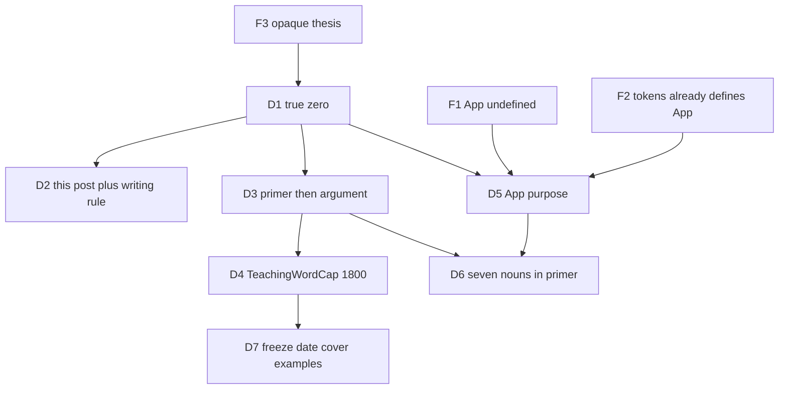

# 0007 — True-zero rewrite of the landing-floor post

Trail: [`trails/0007-landing-floor-true-zero.html`](trails/0007-landing-floor-true-zero.html)

## Executive Summary

The live post talks about a lock and a robot before it says what those words mean. A new reader cannot follow it. This plan puts a short primer of seven plain definitions at the top, then tells the story. It also tells future posts: define every noun before you use it.

## Goals

- A first-time reader can say what a pull request, merge, a GitHub App, and the lock are after this post.
- Later posts on this site follow the same “define first” habit.

## Success criteria

- The primer defines all seven nouns before the argument starts: agent, pull request, merge, GitHub App, lock, stamp, automatic tests.
- GitHub App is taught as purpose, then why it is optional. No setup steps.
- Body word count uses **TeachingWordCap**: strip the TOML between the first two `+++` fences, then `str.split()`. Floor 800. Cap 1800. No padding.
- Two worked examples remain (extra commit; no App still a floor), in true-zero words.
- Date, draft flag, and cover image path stay as they are now unless Dave asks.
- Content check passes. Built HTML contains the seven primer nouns and both example headings.

## In Scope

- Rewrite the landing-floor series post for true-zero readers (primer, then argument).
- Amend the writing standard: define every noun before use; teaching posts may use TeachingWordCap 1800.
- Glossary rows for the seven primer nouns.

## Out of Scope

- Other series posts.
- GitHub App setup, secret keys, or the tokens chapter retold here.
- New images, a date bump, a video.
- A new page layout. The existing post template stays.

## Problem Statement

ELI10 still left “lock merge” and “GitHub App” unexplained. Dave, reading as a newcomer, could not parse the opening. The companion tokens post already defines a GitHub App for practitioners. This post must still teach purpose in its own words, then send people to that chapter only if they want the robot later.

## Locked Decisions

1. **D1 Reader zero-point.** True zero on this post’s words. Teach pull request, merge, GitHub App, then lock vs robot-click. Kitchen language. Do not assume git literacy. `(source: grilling 2026-08-31)`
2. **D2 Scope.** This post plus the writing-standard rule. Do not rewrite the rest of the series until Dave asks. `(source: grilling 2026-08-31)`
3. **D3 Teaching shape.** Primer, then the argument. `(source: grilling 2026-08-31)`
4. **D4 Word budget.** Teaching posts may go to TeachingWordCap 1800. `(source: grilling 2026-08-31)`
5. **D5 GitHub App depth.** Purpose, then why it is optional. A GitHub App is a robot you install on a repo so it can click GitHub buttons as itself — approve, merge — not as you. The lock does not need that robot. No setup. Link the tokens post for later. `(source: grilling 2026-08-31)`
6. **D6 Term list.** All seven nouns live in the primer: agent, pull request, merge, GitHub App, lock, stamp, automatic tests. Do not use SHA, PAT, wrapper, or HEAD. `(source: grilling 2026-08-31)`
7. **Deep-dives.** Skipped. Default: keep both examples; freeze date and cover path; rewrite title/description if they still use undefined words. `(source: grilling 2026-08-31)`

### Verified findings that shaped the locks

- **F1.** This post never defines GitHub App; it later says “when you have not set up a GitHub App.” Informed D5 and D6.
- **F2.** The tokens companion already defines a GitHub App as an automation bot. This post teaches purpose only and must not retell that chapter. Informed D5.
- **F3.** Dave could not parse the live thesis sentences. Informed D1 and D3.
- **F4.** Writing standard is ELI10 and was 800–1300; date/cover frozen unless asked. Informed D4 and D7.
- **F5.** Lavish on the mini-pro is not visible from the MBP. Review stays in chat. Informed persist path, not product shape.

## Decision Trail

## Deliverables

| Deliverable | Size | Acceptance Criteria | Dependencies | Status |
|---|---|---|---|---|
| D1 — Writing rule | XS | Writing standard states: (1) define every noun before use; (2) teaching posts may use TeachingWordCap 1800, no padding; (3) do/don't row matches. | None | Todo |
| D2 — True-zero post | S | Primer defines the seven nouns, then the argument. GitHub App purpose + optional, no setup. TeachingWordCap 800–1800. Both examples kept. Date/draft/cover path unchanged. Title/description do not use undefined nouns. Content check passes. Built page contains the seven nouns and both example headings. | D1 | Todo |

## Testing Decisions

- Word count: TeachingWordCap formula above. Assert 800–1800 before commit.
- Primer-before-argument: the seven definition sentences appear above the first argument heading (the sticky-note / lock story).
- Ban list in the post body: no SHA, PAT, wrapper, HEAD unless Dave later unlocks them.
- Content check + production build. Unique strings: both example headings.

## ⚠️ Irreversible Steps

None.

## User Stories

- **US1.** A reader who has never installed a GitHub App can say what one is for, and why this lock still works without it.
- **US2.** A later agent drafting a series post defines each noun before using it, because the writing standard says so.

No new layout mock: this is copy on the existing post template, not a new UI surface.

## Execution Tracking

Issues: [#155](https://github.com/DaveVoyles/DaveVoylesdotCom/issues/155) D1, [#156](https://github.com/DaveVoyles/DaveVoylesdotCom/issues/156) D2. Label `plan:0007`. No board file in this repo.

## Hand-off (paste-ready)

Plan: https://github.com/DaveVoyles/DaveVoylesdotCom/blob/main/docs/design/0007-landing-floor-true-zero.md

Issues: [#155](https://github.com/DaveVoyles/DaveVoylesdotCom/issues/155) (D1), [#156](https://github.com/DaveVoyles/DaveVoylesdotCom/issues/156) (D2, blocked on D1). Label `plan:0007`.

Board: none in this repo — use the issue list.

Executor playbook: `orchestrate`. Claim any open, unblocked, unassigned issue under `plan:0007`. One orchestrator. Implement per slice. Do not start until this plan is on main.

Frontier: D1 then D2. D2 is blocked on D1.
