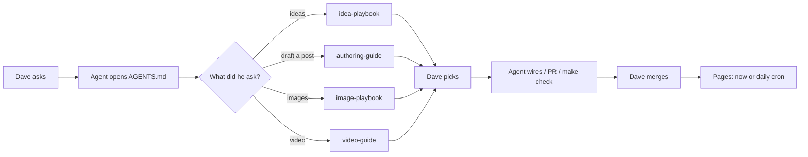

# How a post gets made

Map of **Dave + agent + the site** for davevoyles.com. Open this before
inventing a new process.

Interactive diagram (dark/light, export PNG):
[`diagrams/post-pipeline.html`](diagrams/post-pipeline.html)
(open the file in a browser — it is not on the live site).

`AGENTS.md` is a **router**, not the playbook. It tells the agent which
doc to open. This page is the whole pipeline.

---

## Flow

**The rule:** every playbook that proposes (ideas, images, video preview)
**stops**. Dave names the pick. Then the agent implements.

---

## Who does what

| Step | Dave | Agent | Together |
|------|------|-------|----------|
| 1. Ask | Say what you want in plain language (“propose ideas”, “draft X”, “4–5 covers”, “ship it”) | Read [`AGENTS.md`](../AGENTS.md), then **only** the matching doc | — |
| 2. Ideas | — | [`idea-playbook.md`](idea-playbook.md): Chat-Agents mission → recent docs → existing slugs. 8–12 titles + angles. **Stop.** | Dave picks a title |
| 3. Draft | Voice notes if you have them | [`authoring-guide.md`](authoring-guide.md) + [`claim-safe-facts.md`](claim-safe-facts.md). Series: [`series/README.md`](series/README.md) + `./scripts/new-series-post.sh`. Unique cover path. `make series-schedule` | Dave edits voice in the PR |
| 4. Images | Look at `~/Desktop/<slug>-image-picks/` (terminal cannot show Imagine links) | [`image-playbook.md`](image-playbook.md): 4–5 options from the post, one object per frame, then **stop** | Dave names cover + any body shots |
| 5. Wire art | — | Thesis → `[cover]`. Other picks under the matching H2. Never inline the cover. `make check` | — |
| 6. Review | Read the PR / `make preview` | `make check`, branch, open PR. Do not change `date`/`draft` unless asked | Merge is Dave’s (or “land it” in chat) |
| 7. Live | Hard-refresh after Pages (~1 min) | — | Daily cron (≈10:00 ET) ships `draft=false` + future `date`. Status on the series overview is computed at build time |
| 8. Video (opt-in) | Watch the MP4 | [`video-guide.md`](video-guide.md): preview, **stop**, then publish only if asked | Dave says the render is good |

---

## What `AGENTS.md` is for

First file in a new session. It does three jobs:

1. **Bootstrap** — `git submodule update --init --recursive` then `make preview`.
2. **Route** — the “Which doc for which task” table. Do not skip it.
3. **Hard rules** — claim-safe language, About front matter, no PaperMod
   edits, home caps, topics/tags, auto-publish, image pick-list.

It does **not** contain the idea recipe, the voice do/don’t, or the
image prompts. Those live in the linked docs so they stay short.

Close-out (every session that changes the repo): one line on
`history.md`; overwrite `HANDOFF.md`.

---

## What you should say

| You say | Agent does | Stops when |
|---------|------------|------------|
| “Propose some blog ideas” | Idea playbook | A pick-list is in chat |
| “Draft a post about X, angle Y” | Authoring guide, new branch, PR | You can read the draft |
| “Propose 4–5 covers” | Image playbook, Desktop folder + `open` | You can see the files |
| “Use 1 as cover, 3 in that section” | Wires files, `make check`, PR | PR is open |
| “Land it” / “push to remote” | Merge to `main` (or push the branch you named) | Pages rebuild has started |
| “Make a video” | Preview render only | You have watched the MP4 |

If two of those are in one message (“draft and land”), the agent still
uses the same gates — it does not skip the pick on images or upload a
video unasked.

---

## What the agent must not do

- Draft a post from the idea playbook.
- Auto-wire a cover from the image playbook.
- Invent metrics, board counts, or “I built OpenClaw.”
- Reuse another series post’s cover (check fails).
- Hand-edit Live/Scheduled on the series table (computed at build).
- Edit `themes/PaperMod/` for features.
- Change `date` / `draft` unless you asked.

---

## Related

| Doc | Role |
|-----|------|
| [`AGENTS.md`](../AGENTS.md) | Router + hard rules |
| [`idea-playbook.md`](idea-playbook.md) | Titles + angles, then stop |
| [`authoring-guide.md`](authoring-guide.md) | Voice + how to write a post |
| [`image-playbook.md`](image-playbook.md) | Covers / body images, then stop |
| [`claim-safe-facts.md`](claim-safe-facts.md) | Allowed numbers and titles |
| [`series/README.md`](series/README.md) | Series scaffold + auto-publish |
| [`platform-guide.md`](platform-guide.md) | What the static site can and cannot do |
| [`video-guide.md`](video-guide.md) | Opt-in video preview → publish |
